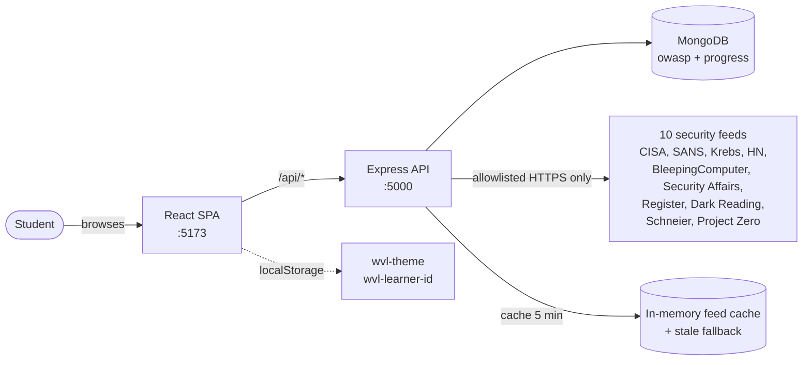
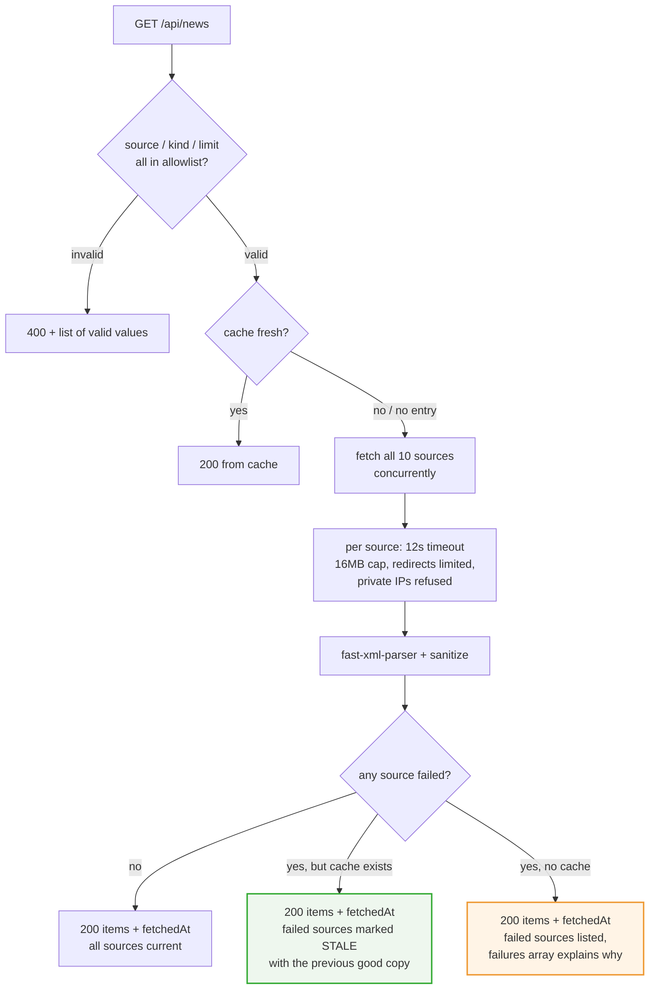
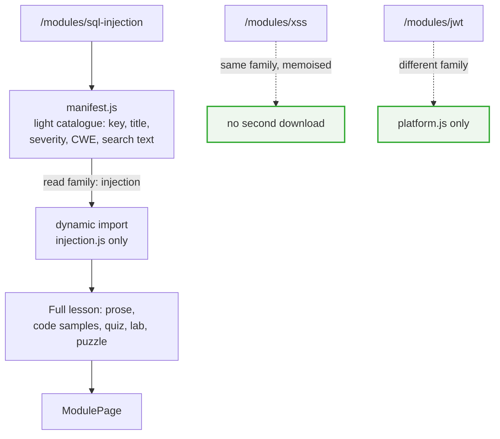
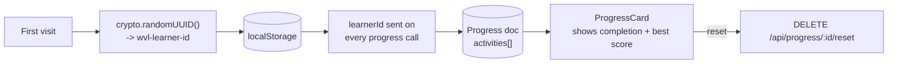
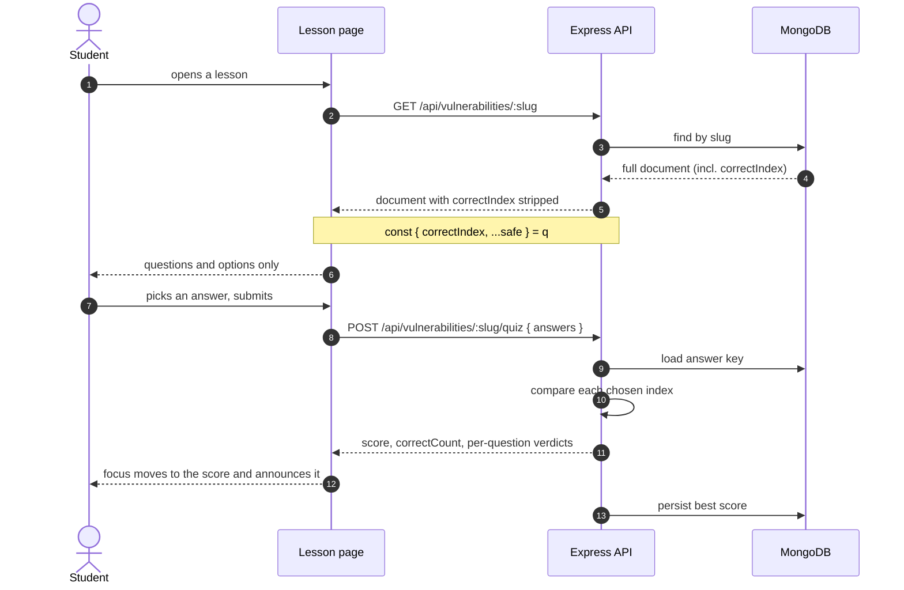
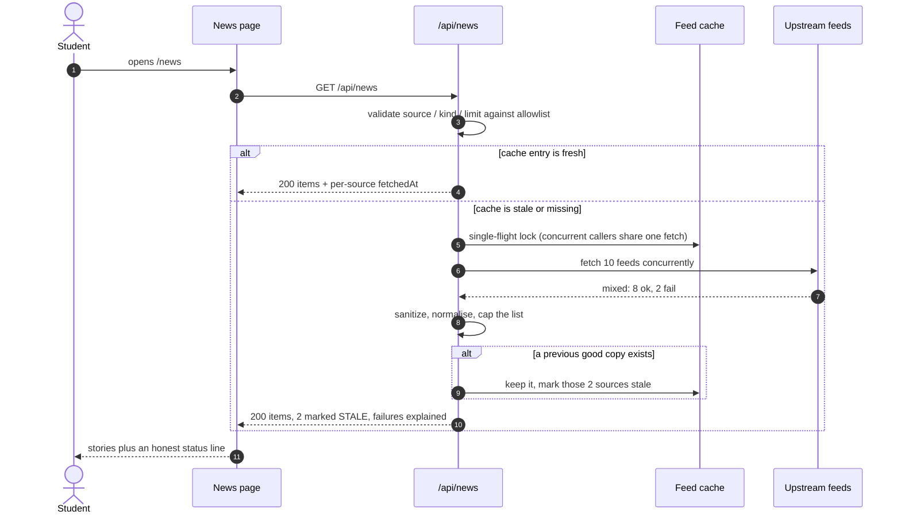

# Web Vulnerability Learning Environment

A self-contained teaching app for the **OWASP Top 10** and its history across all eight official
editions (2003, 2004, 2007, 2010, 2013, 2017, 2021, 2025).

Two tracks run through the app:

- **The history track** — 8 release documents, 80 category documents. Follow the timeline, read
  plain-English lessons, take server-graded quizzes, compare how one idea changed name and shape
  across editions.
- **The 24-module track** — the current practical catalogue, grouped into 5 families, each module
  with a lesson, a safe local lab, and an interactive puzzle.

Plus a live security-news feed built from a hardcoded allowlist of 10 publications.

> **Safety scope.** Every lab, puzzle and example is local and simulated. Nothing in this project
> scans, probes or attacks a system you do not own. The news feed only ever fetches the fixed set
> of sources listed in [`backend/src/data/newsSources.js`](backend/src/data/newsSources.js).

---

## Table of contents

- [Tech stack](#tech-stack)
- [Quick start](#quick-start)
- [Environment variables](#environment-variables)
- [npm scripts](#npm-scripts)
- [Architecture](#architecture)
- [Use cases](#use-cases)
- [Data flow diagrams](#data-flow-diagrams)
- [Sequence diagrams](#sequence-diagrams)
- [Module content model](#module-content-model)
- [API reference](#api-reference)
- [Accessibility](#accessibility)
- [Security notes](#security-notes)
- [Verification](#verification)
- [Project layout](#project-layout)
- [Troubleshooting](#troubleshooting)
- [License](#license)

---

## Tech stack

| Layer | Technology | Version |
| --- | --- | --- |
| Backend | Node.js + Express | 18+ / 4.21 |
| Database | MongoDB via Mongoose | 8.7 |
| Security headers | helmet | 8.0 |
| Feed parsing | fast-xml-parser | 5.11 |
| Frontend | React + Vite | 19.2 / 6.0 |
| Routing | react-router-dom | 7.1 |
| Icons | react-icons | 5.3 |
| Styling | Plain CSS with custom-property tokens | — |

No CSS framework, no UI kit, no state-management library. Theming is a single
`[data-theme="dark"]` attribute plus CSS custom properties.

---

## Quick start

### Prerequisites

- **Node.js 18+** and npm — check with `node -v`
- **MongoDB** running locally, or a MongoDB Atlas connection string

No global installs are required.

### 1. Backend (port 5000)

```bash
cd backend
npm install

# Windows
copy .env.example .env
# Linux / macOS
# cp .env.example .env

npm run seed      # loads 8 releases + 80 vulnerability documents
npm run dev       # API on http://localhost:5000
```

Confirm it is alive:

```bash
curl http://localhost:5000/api/health
# {"success":true,"data":{"status":"ok","uptimeSeconds":3},...}
```

### 2. Frontend (port 5173)

In a second terminal:

```bash
cd frontend
npm install
npm run dev
```

Open **http://localhost:5173**.

The Vite dev server proxies `/api` to `http://localhost:5000` (see
[`frontend/vite.config.js`](frontend/vite.config.js)), so the frontend calls `/api/owasp/timeline`
and Vite forwards it. **No CORS configuration is needed in development** — the proxy makes the
browser see a same-origin request.

### Production build

```bash
cd frontend
npm run build      # -> frontend/dist
npm run preview    # serve the build on http://localhost:4173
```

Point the built app at a real API host at build time:

```bash
# Linux / macOS
VITE_API_BASE_URL=https://api.example.com/api npm run build

# Windows PowerShell
$env:VITE_API_BASE_URL="https://api.example.com/api"; npm run build
```

If `VITE_API_BASE_URL` is unset the app uses same-origin `/api`, which is what you want when the
API serves the static files itself.

---

## Environment variables

Backend, from [`backend/.env.example`](backend/.env.example):

| Variable | Default | Purpose |
| --- | --- | --- |
| `PORT` | `5000` | Port Express listens on |
| `NODE_ENV` | `development` | `production` switches morgan to `combined` logging |
| `MONGO_URI` | `mongodb://127.0.0.1:27017/webvulnlab` | Connection string |
| `CLIENT_ORIGIN` | `http://localhost:5173,http://127.0.0.1:5173` | Comma-separated CORS allowlist |
| `NEWS_REFRESH_TOKEN` | *unset* | Required to force a news cache refresh. Unset means no public refresh path exists |

Frontend, optional and read at build time:

| Variable | Default | Purpose |
| --- | --- | --- |
| `VITE_API_BASE_URL` | `/api` | API base URL for the built bundle |

> **Never commit `backend/.env`.** It holds the MongoDB credentials and the refresh token. Only
> `.env.example` belongs in version control.

### Why `NEWS_REFRESH_TOKEN` is unset by default

`GET /api/news` normally serves a cached feed. A public `?refresh=true` would let anyone force a
re-fetch of 10 external sites, which is a denial-of-service lever pointed at third parties. The
controller only honours a refresh when the caller presents the server-side token, so with the
variable unset there is no public way to bypass the cache at all.

---

## npm scripts

### Backend

| Script | What it does |
| --- | --- |
| `npm run dev` | `nodemon src/server.js` — restarts on file change |
| `npm start` | `node src/server.js` — plain start, no watcher |
| `npm run seed` | Idempotent seed: upserts releases and vulnerabilities, validates ranks 1–10 |

### Frontend

| Script | What it does |
| --- | --- |
| `npm run dev` | Vite dev server on 5173 with the `/api` proxy |
| `npm run build` | Production bundle into `dist/` |
| `npm run preview` | Serves `dist/` on 4173 |
| `npm run manifest` | Regenerates `src/data/modules/manifest.js` from the five family files |
| `npm run smoke` | Renders every route headless and asserts 24 modules, 5 families, 24 resolved icons |

Run `npm run manifest` after editing any module, then `npm run smoke` to prove the generated file
still matches its source.

---

## Architecture

```
┌──────────────────────────────────────────────────────────────────────┐
│  Browser                                                             │
│  React 19 SPA — 8 routes, no auth, theme + learnerId in localStorage │
└────────────────────────────┬─────────────────────────────────────────┘
                             │  fetch "/api/..."  (same-origin via Vite proxy)
                             ▼
┌──────────────────────────────────────────────────────────────────────┐
│  Express 4 — helmet → cors → body parser → morgan → routes → 404 →   │
│              error handler                                            │
│                                                                      │
│  /api/owasp ────────┐                                                │
│  /api/vulnerabilities ──┼── controllers ── Mongoose ── MongoDB       │
│  /api/progress ─────┤      │                                           │
│  /api/news ─────────┘      └── newsService ──► 10 allowlisted feeds  │
└──────────────────────────────────────────────────────────────────────┘
```

The app is split so that **shared sidebar and search CSS lives in one file**
(`global.css`) and page styles cannot quietly override it. `modules.css` holds only module-page
styles. A static check enforces this — the suite fails if the same top-level selector is defined
in two files with different values.

### Two content systems, one API

The history track and the module track are deliberately separate:

- **History track** lives in **MongoDB**, seeded from `backend/src/data/owaspReleases.js` and
  `vulnProfiles.js`. Long teaching text is shared across 29 concept profiles and copied into each
  document at seed time.
- **Module track** lives **entirely in the frontend bundle** under
  `frontend/src/data/modules/`. It is loaded per family, so opening the SQL injection lesson does
  not download the GraphQL lesson or the other 22.

That means the module catalogue works with no database at all, and the history track is the part
that benefits from a real store.

---

## Use cases

### For a learner

| # | Use case | Where |
| --- | --- | --- |
| UC-1 | See how the Top 10 changed across all 8 editions on one timeline | `/owasp` |
| UC-2 | Read a plain-English lesson for one category in one year | `/owasp/vulnerability/:slug` |
| UC-3 | Take a server-graded quiz and see which answers were wrong | lesson page → Quiz |
| UC-4 | Complete a safe local lab and reveal the model solution on request | lesson page → Lab |
| UC-5 | Follow one idea across editions to see what it was renamed to | lesson page → evolution strip |
| UC-6 | Work through a 24-module catalogue grouped by attack family | `/modules` |
| UC-7 | Solve an interactive puzzle: order a request path, spot the payload, pick the right header, sort by severity | `/modules/:moduleKey` |
| UC-8 | Read current advisories and security news from 10 known publications | `/news` |
| UC-9 | Switch between dark and light themes; the choice persists | sidebar footer |
| UC-10 | Come back later and keep progress — keyed on a generated `learnerId` | progress card |

### For an instructor

| # | Use case | Notes |
| --- | --- | --- |
| UC-11 | Project the timeline in a lecture and drill one year | `?year=` on `/owasp` |
| UC-12 | Use the labs as discussion prompts — nothing leaves the machine | all labs are local |
| UC-13 | Let students self-check against the OWASP timeline across a term | 8 editions, 80 categories |
| UC-14 | Point students at the current catalogue by severity | `/modules`, sortable worst-first |

### For a developer

| # | Use case | Notes |
| --- | --- | --- |
| UC-15 | Add a module | edit the family file, `npm run manifest`, `npm run smoke` |
| UC-16 | Add a news source | add one entry to the allowlist — it is validated at startup |
| UC-17 | Deploy the SPA against a hosted API | `VITE_API_BASE_URL` at build time |
| UC-18 | Verify a change did not break routing or the catalogue | `npm run smoke` |
| UC-19 | Force a feed refresh in a test environment | set `NEWS_REFRESH_TOKEN`, then pass it as the `refresh` query value |

---

## Data flow diagrams

### 1. System context



### 2. News feed — the honest path

This is the most involved flow, because a feed that silently shows nothing is worse than one that
admits it failed.



Three rules this flow enforces:

1. **A failed refresh never blanks the page.** Old stories stay on screen, clearly labelled as the
   last known good copy, with the reason and the last successful fetch time.
2. **Timestamps are honest.** The top-level `fetchedAt` is the *oldest* contributing source fetch,
   not the request time. Each source carries its own `fetchedAt`.
3. **Failures are attributed correctly.** A source's `lastError` describes that source. The separate
   `failures` array is for transport-level problems. They are not the same field.

### 3. Module lesson loading — per-family code splitting



The loader map is written out explicitly rather than computed as
`import(\`./${familyId}.js\`)`. A computed import makes the bundler emit a glob of every possible
path and quietly give the saving back; written out, it produces five real chunks.

### 4. Learner progress



There is no login. The "learner" is a random id in `localStorage`, so progress survives closing the
tab but is not tied to a person. To add auth later, delete `frontend/src/api/learner.js` and read
the id from the JWT — nothing else changes.

---

## Sequence diagrams

### Quiz grading — the answer key never reaches the browser



`correctIndex` is stripped by the controller on the way out and only ever compared on the way in.
A student cannot read the key out of devtools, because it was never sent.

### News feed, including the cache-miss path



Single-flight matters: ten browser tabs opening at once produce **one** round of upstream
requests, not ten.

---

## Module content model

The 24 modules, grouped into 5 families:

| Family | Modules | Focus |
| --- | --- | --- |
| **Injection** | SQL injection, XSS, OS command injection, SSTI | Untrusted text handed to an interpreter |
| **Identity & Access** | IDOR, broken authentication, session flaws, CSRF, OAuth/OIDC | Who you are and what you may touch |
| **Data & Secrets** | Path traversal, SSRF, XXE, insecure deserialization | Reading what you should not |
| **Browser & Client** | CORS, clickjacking, client-side storage, cache poisoning | The hop through the browser |
| **Platform & Supply Chain** | Misconfiguration, outdated components, integrity failures, crypto failures, JWT, request smuggling, GraphQL abuse | Not a bug in your code |

Severity spread: 6 critical, 16 high, 2 medium.

Each module carries a CWE identifier, its OWASP history entries, further-reading references, a
vulnerable and a secure code sample, a line-by-line walkthrough, a lab, and a puzzle.

### Puzzle types

Every module has exactly one puzzle — 24 in total. The `Puzzle` component supports six types
(`OrderPuzzle`, `SpotPuzzle`, `PayloadPuzzle`, `HeadersPuzzle`, `PickPuzzle`, `SortPuzzle`); the
catalogue currently uses three of them:

| Type | Modules | Interaction |
| --- | --- | --- |
| `spot` | 13 | Click the line in the sample that carries the bug |
| `headers` | 7 | Choose the correct HTTP header configuration |
| `payload` | 4 | Assemble a payload and check how the server reacts |

`order`, `pick` and `sort` are implemented and ready but not used yet — the `Puzzle` component
dispatches on `type`, so adding one to a module is a data change only.

---

## API reference

Base URL `http://localhost:5000`. All responses use the same envelope:

```json
{ "success": true, "data": {}, "message": "..." }
```

### Health

| Method | Endpoint | Purpose |
| --- | --- | --- |
| GET | `/api/health` | Status and uptime |

### OWASP editions

| Method | Endpoint | Purpose |
| --- | --- | --- |
| GET | `/api/owasp/timeline` | All 8 editions with their 10 entries, one call |
| GET | `/api/owasp/stats` | Dashboard counts |
| GET | `/api/owasp/releases` | All releases; `?brief=true` for the light version |
| GET | `/api/owasp/releases/latest` | Newest edition (2025) |
| GET | `/api/owasp/releases/:year` | One edition with category summaries |
| GET | `/api/owasp/releases/:year/changes` | Added / removed / carried-over comparison |

### Vulnerabilities

| Method | Endpoint | Purpose |
| --- | --- | --- |
| GET | `/api/vulnerabilities/search?q=` | Free-text search |
| GET | `/api/vulnerabilities/concepts` | The 29 shared concept profiles |
| GET | `/api/vulnerabilities/concept/:conceptKey/evolution` | One idea across editions |
| GET | `/api/vulnerabilities/year/:year` | The 10 categories of one year |
| GET | `/api/vulnerabilities/year/:year/:owaspId` | One category, e.g. `2021/A01` |
| GET | `/api/vulnerabilities/:slug` | Full lesson, **answer key stripped** |
| POST | `/api/vulnerabilities/:slug/quiz` | Server-side grading |
| GET | `/api/vulnerabilities/:slug/lab` | Safe lab without the solution |
| GET | `/api/vulnerabilities/:slug/lab/solution` | Model answer, on request |

### Progress

| Method | Endpoint | Purpose |
| --- | --- | --- |
| GET | `/api/progress/:learnerId` | All recorded activity |
| GET | `/api/progress/:learnerId/stats` | Completion counts and best scores |
| POST | `/api/progress/:learnerId/complete` | Mark one activity complete |
| DELETE | `/api/progress/:learnerId/reset` | Clear progress for this learner |

### News

| Method | Endpoint | Purpose |
| --- | --- | --- |
| GET | `/api/news` | Aggregated feed. Filters: `?source=`, `?kind=`, `?limit=` |
| GET | `/api/news/sources` | The allowlist, with names, sites and blurbs |

Every filter is validated against the allowlist. An unknown `source` or `kind` returns **400** with
the list of valid values rather than silently returning an empty feed.

`?refresh=<token>` forces a cache bypass, but only when the value matches
`NEWS_REFRESH_TOKEN`. With that variable unset the refresh path does not exist.

---

## Accessibility

This is a teaching app about secure defaults, so the accessibility work is treated as part of the
same discipline.

- **Skip link** to main content, visible on focus.
- **Focus management** — route changes move focus to the page heading; opening the mobile drawer
  moves focus inside it; closing restores focus to the hamburger button.
- **Focus trap** in the mobile drawer, `Escape` closes it, and the rest of the page is `inert`
  while it is open. The module sublist is `inert` while collapsed.
- **Theme toggle** has a stable visible label plus `aria-pressed`.
- **Live regions** — quiz scores, puzzle verdicts, progress counters and error states are announced
  rather than only rendered.
- **Progress bar** exposes `role="progressbar"`, not a decorative div.
- **Contrast** — every text/background pair in both themes is verified to pass WCAG AA.
- **Reduced motion** — `prefers-reduced-motion` disables the remaining hover transitions and the
  feed's fade-in.
- **Honest empty states** — loading, error, empty and reset states are all distinct and all say
  what actually happened.

### Theming

Dark and light are both real themes, not a filter. Dark is the default; the choice is saved under
`wvl-theme` and applied by a small inline script in `index.html` **before React loads**, so there
is no flash of the wrong theme.

The dark theme is strictly monochrome — pure black and white with neutral greys in between.
Hierarchy comes from lightness steps and the brutalist borders, not from hue. Surfaces are spaced
in even ~1.2:1 steps so panels stay visibly distinct; the tightest text pair is
`--text-faint` on `--surface-2` at 5.16:1, and brand text on white is 21:1.

---

## Security notes

The project practices what it teaches. There are no exploits in it, but the fetch code is
defended in depth because it *does* reach the public internet.

**Backend**

- `helmet` sets security headers on every response.
- CORS is an explicit allowlist from `CLIENT_ORIGIN`. A missing `Origin` header is allowed through
  because browsers always send one — that is `curl`, not a hostile page.
- JSON body limit is 1 MB.
- The news fetcher refuses private and link-local IP ranges, so a source cannot redirect the server
  into its own network or the cloud metadata service.
- Redirects are limited and re-validated at each hop.
- Per-source timeout and response size caps.
- Parsed output is sanitized before it is returned; nothing is rendered as raw HTML.

**Frontend**

- `dangerouslySetInnerHTML` is not used anywhere.
- The quiz answer key is stripped server-side and never reaches the browser.
- External links carry `rel="noreferrer noopener"`.
- No secrets in the bundle. The build-time API URL is the only configuration exposed.

**Known limitations, stated plainly**

- There is no authentication, so `learnerId` is a bearer token. Anyone who learns another
  learner's id can read and reset their progress. This is a deliberate teaching simplification,
  and it is the first thing to fix before exposing this to a real network.
- The news feed trusts upstream markup after sanitisation. Treat feed content as untrusted.
- Progress endpoints are unauthenticated for the same reason.

---

## Verification

| Check | Command | What it proves |
| --- | --- | --- |
| Route render | `cd frontend && npm run smoke` | 24 modules, 5 families, 24 icons resolved |
| Production build | `cd frontend && npm run build` | The bundle compiles |
| Seed integrity | `cd backend && npm run seed` | Ranks 1–10 valid, every concept profile resolves |

Beyond those three, the layout, contrast, container-width, CSS-ownership, encoding and news-security
checks were run as one-off Node scripts during development. They are not wired into
`package.json` yet — if you want them in CI, they are the scripts to pull in first.

---

## Project layout

```
WebVulnerabilityLab/
├── backend/
│   ├── .env.example
│   └── src/
│       ├── app.js                  builds the Express app, does not listen
│       ├── server.js               the only file that calls app.listen()
│       ├── config/db.js            Mongoose connection
│       ├── controllers/            one per resource
│       ├── data/
│       │   ├── owaspReleases.js     8 editions
│       │   ├── vulnProfiles.js      29 shared concept profiles
│       │   └── newsSources.js       the fetch allowlist
│       ├── middleware/             AppError, errorHandler, notFound
│       ├── models/                 OwaspRelease, Vulnerability, Progress
│       ├── routes/                 one router per resource
│       ├── seed/seed.js
│       ├── services/newsService.js  fetch, parse, sanitise, cache
│       └── utils/ApiResponse.js
│
├── frontend/
│   ├── index.html                  includes the no-flash theme script
│   ├── vite.config.js              dev server + /api proxy
│   ├── scripts/                    smoke-routes, build-manifest
│   └── src/
│       ├── App.jsx                 all 8 routes
│       ├── api/                    client, owaspApi, newsApi, learner
│       ├── components/
│       │   ├── layout/             Layout, Sidebar
│       │   ├── module/             Puzzle (6 types), AttackDiagram, HistoryStrip
│       │   └── owasp/              Quiz, LabPanel, ProgressCard, CodeBlock, …
│       ├── context/ThemeContext.jsx
│       ├── data/modules/           5 family files + generated manifest
│       ├── lib/                    diagramLayout, moduleFormat
│       ├── pages/                  8 page components
│       └── styles/                 global.css, pages.css, modules.css
│
└── README.md
```

### CSS ownership

| File | Owns |
| --- | --- |
| `global.css` | Tokens, both themes, reset, layout shell, **sidebar and its internals**, search box, buttons, cards, reduced motion |
| `pages.css` | Page-specific styles, feed, news filters |
| `modules.css` | Module page only: diagrams, puzzles, reference panels |

App chrome lives in `global.css` on purpose. It was previously split across files, and page styles
silently overrode sidebar internals. A static check now fails the suite if the same top-level
selector is defined twice with different values.

---

## Troubleshooting

**`MongooseServerSelectionError` on startup**
MongoDB is not running, or `MONGO_URI` is wrong. Test the connection directly:
`mongosh "mongodb://127.0.0.1:27017/webvulnlab"`.

**Frontend loads but every panel says "could not load"**
The backend is not running, or it is on a different port. Check
`http://localhost:5000/api/health`. If you changed `PORT`, update the proxy target in
`vite.config.js` to match.

**`CORS blocked` in the server log**
The frontend origin is not in `CLIENT_ORIGIN`. Add it, comma-separated. In normal dev this should
not happen, because the Vite proxy means the browser sends a same-origin request.

**The feed is empty**
Most sources block automated requests. This is expected and the UI says so rather than showing a
blank panel. Check `GET /api/news/sources` for per-source status, and the `failures` array for the
reason. To retry during development, set `NEWS_REFRESH_TOKEN` and pass the same value as `?refresh=`.

**Progress is empty after clearing site data**
`learnerId` lives in `localStorage` under `wvl-learner-id`. Clearing site data mints a new one and
the old progress is orphaned. There is no way to recover it — this is a consequence of having no
accounts.

**A new module does not appear**
Run `npm run manifest` to regenerate the catalogue, then `npm run smoke`. The manifest is
generated and committed; editing a family file alone changes nothing.

**The build looks unchanged after a CSS edit**
Check the hashed filename in `dist/assets/`. Vite content-hashes filenames, so a correct change
always produces a new name. A stale name means you are viewing a cached `index.html`.

---

## License

Teaching material and source code for educational use. If you intend to publish this, add a
`LICENSE` file — there is not one yet, and the absence of a licence means all rights are reserved
by default.

The lesson text, the 29 concept profiles and the lab content are original material written for
this project. OWASP, CWE, MITRE ATT&CK and NIST are referenced as external standards and remain
the property of their respective publishers.
## Updated by Teju

