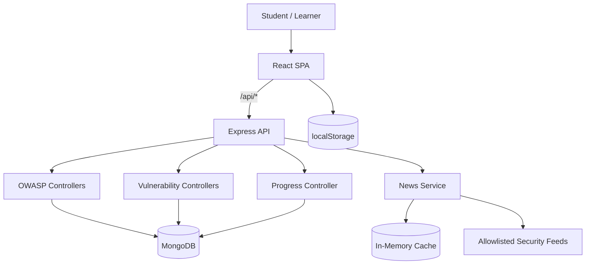
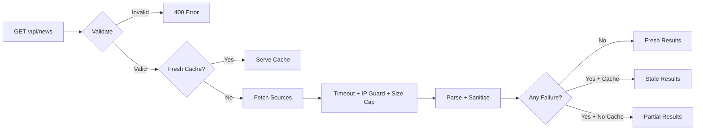

<div align="center">

<!-- Animated typing header -->
<a href="https://github.com/TejuCodes">
  
</a>

<br>


<p>
  <strong>A self-contained cybersecurity teaching platform built around OWASP Top 10 history, practical modules, safe local labs and interactive puzzles.</strong>
</p>

<p>
  
  
  
  
</p>

<p>
  <a href="#-features">Features</a> •
  <a href="#-architecture">Architecture</a> •
  <a href="#-quick-start">Quick Start</a> •
  <a href="#-security">Security</a> •
  <a href="#-project-layout">Project Layout</a>
</p>

</div>

---

## ⚡ What is this?

**Web Vulnerability Learning Environment** is a hands-on cybersecurity education platform designed to make web security easier to understand through **history + practice + interaction**.

The application combines:

- 📚 **OWASP Top 10 history** across eight official editions
- 🧩 **24 practical security modules**
- 🧪 **Safe local labs** and simulated scenarios
- 🧠 **Server-graded quizzes**
- 🎯 **Interactive vulnerability puzzles**
- 📰 **Security-news aggregation** from an allowlisted source set
- 📈 **Learner progress** using a generated local learner ID
- 🌗 **Dark / light themes**
- ♿ **Accessibility-first interaction**

> [!IMPORTANT]
> **Safety scope:** all labs, puzzles and examples are local and simulated. The application does not scan, probe or attack systems that the learner does not own.

---

## ✨ Features

<table>
<tr>
<td width="50%">

### 🕰️ OWASP Time Machine

Explore **8 OWASP editions**:

`2003` → `2004` → `2007` → `2010`  
`2013` → `2017` → `2021` → `2025`

Compare categories, names and evolution across releases.

</td>
<td width="50%">

### 🧪 24 Cybersecurity Modules

Five learning families:

- Injection
- Identity & Access
- Data & Secrets
- Browser & Client
- Platform & Supply Chain

</td>
</tr>

<tr>
<td>

### 🎮 Interactive Learning

Each module can contain:

- Lesson
- Vulnerable code
- Secure code
- Line-by-line explanation
- Safe lab
- Quiz
- Interactive puzzle

</td>
<td>

### 📰 Security News

A controlled news layer fetches from a fixed allowlist and uses:

- Cache
- Stale fallback
- Per-source status
- Timeouts
- Response-size limits
- Sanitisation

</td>
</tr>
</table>

---

## 🧭 Two Learning Tracks

```text
                    ┌───────────────────────────┐
                    │   SECURE LEARNING HUB     │
                    └─────────────┬─────────────┘
                                  │
                ┌─────────────────┴─────────────────┐
                ▼                                   ▼
       ┌──────────────────┐                ┌──────────────────┐
       │  OWASP HISTORY   │                │ PRACTICAL TRACK  │
       ├──────────────────┤                ├──────────────────┤
       │ 8 editions       │                │ 24 modules       │
       │ 80 categories    │                │ 5 families       │
       │ Evolution        │                │ Labs             │
       │ Quizzes          │                │ Puzzles          │
       └────────┬─────────┘                └────────┬─────────┘
                │                                   │
                └─────────────────┬─────────────────┘
                                  ▼
                       ┌─────────────────────┐
                       │  LEARN → PRACTICE   │
                       │  → UNDERSTAND       │
                       └─────────────────────┘
```

---

## 🧱 Tech Stack

| Layer | Technology |
|---|---|
| Frontend | React + Vite |
| Backend | Node.js + Express |
| Database | MongoDB + Mongoose |
| Security Headers | Helmet |
| Routing | React Router |
| Feed Parsing | fast-xml-parser |
| Icons | react-icons |
| Styling | Plain CSS + custom properties |
| Development | npm + Vite + Nodemon |

No CSS framework or UI kit is required.

---

## 🏗️ Architecture



### Frontend

```text
React 19
   │
   ├── Pages
   ├── Components
   ├── Context
   ├── API clients
   ├── Module catalogue
   └── Theme system
```

### Backend

```text
Express
   │
   ├── Routes
   ├── Controllers
   ├── Services
   ├── Middleware
   ├── Models
   └── MongoDB
```

---

## 🌀 The Learning Loop

<div align="center">

```text
┌────────┐     ┌──────────┐     ┌─────────┐
│  READ  │ ──▶ │  EXPLORE │ ──▶ │  LAB    │
└────────┘     └──────────┘     └────┬────┘
     ▲                               │
     │                               ▼
┌────────┐     ┌──────────┐     ┌─────────┐
│ REPEAT │ ◀── │  REVIEW  │ ◀── │  QUIZ   │
└────────┘     └──────────┘     └─────────┘
```

**Concept → Example → Practice → Test → Understand**

</div>

---

## 🧩 Module Catalogue

| Family | Modules | Focus |
|---|---|---|
| **Injection** | SQL Injection, XSS, OS Command Injection, SSTI | Untrusted input reaching interpreters |
| **Identity & Access** | IDOR, Broken Authentication, Session Flaws, CSRF, OAuth/OIDC | Identity, permissions and sessions |
| **Data & Secrets** | Path Traversal, SSRF, XXE, Insecure Deserialization | Accessing protected resources |
| **Browser & Client** | CORS, Clickjacking, Client Storage, Cache Poisoning | Browser-side security |
| **Platform & Supply Chain** | Misconfiguration, Outdated Components, Integrity Failures, Crypto Failures, JWT, Request Smuggling, GraphQL Abuse | Platform and application architecture |

**Current spread:** 6 critical · 16 high · 2 medium

---

## 🎯 Puzzle Engine

Every module has a puzzle.

```text
             ┌───────────────┐
             │    PUZZLE     │
             └───────┬───────┘
                     │
       ┌─────────────┼─────────────┐
       ▼             ▼             ▼
    SPOT          HEADERS       PAYLOAD
       │             │             │
   Find bug      Choose safe    Build safe
   in code       HTTP setup     test input
```

Supported puzzle types:

- `spot`
- `headers`
- `payload`
- `order`
- `pick`
- `sort`

The current catalogue uses **spot, headers and payload**.

---

## 🚀 Quick Start

### Requirements

- Node.js 18+
- npm
- MongoDB running locally **or** MongoDB Atlas

### 1. Backend

```bash
cd backend
npm install
```

Create `.env`:

```env
PORT=5000
NODE_ENV=development
MONGO_URI=mongodb://127.0.0.1:27017/webvulnlab
CLIENT_ORIGIN=http://localhost:5173,http://127.0.0.1:5173
```

Seed the database:

```bash
npm run seed
```

Start the API:

```bash
npm run dev
```

Health check:

```bash
curl http://localhost:5000/api/health
```

### 2. Frontend

Open another terminal:

```bash
cd frontend
npm install
npm run dev
```

Open:

```text
http://localhost:5173
```

### 3. Production Build

```bash
cd frontend
npm run build
npm run preview
```

---

## 🔐 Security by Design

The project demonstrates secure engineering instead of teaching only vulnerable behaviour.

### Backend

- `helmet` security headers
- Explicit CORS allowlist
- JSON body limit
- Private / link-local IP blocking
- Redirect validation
- Per-source request timeout
- Response-size cap
- Sanitised feed output
- Server-side quiz grading

### Frontend

- No `dangerouslySetInnerHTML`
- Quiz answer key never sent to browser
- External links use `rel="noreferrer noopener"`
- No secrets inside the frontend bundle
- Reduced-motion support
- Focus management
- Keyboard-friendly mobile drawer

---

## 🛡️ Safe News Fetching



A failed refresh does **not** intentionally blank the entire news page. Previous good data can remain visible with a stale status.

---

## 🧠 Quiz Security

The correct answer is never shipped to the browser.

```text
Student
   │
   │ answers
   ▼
React Page
   │
   │ POST /quiz
   ▼
Express API
   │
   │ loads correctIndex
   ▼
MongoDB
   │
   │ compare
   ▼
Score + Verdicts
   │
   ▼
Student
```

This prevents learners from simply inspecting the answer key in browser developer tools.

---

## 📡 API Overview

### OWASP

| Method | Endpoint | Purpose |
|---|---|---|
| GET | `/api/owasp/timeline` | Complete 8-edition timeline |
| GET | `/api/owasp/stats` | Dashboard statistics |
| GET | `/api/owasp/releases` | All releases |
| GET | `/api/owasp/releases/latest` | Latest edition |
| GET | `/api/owasp/releases/:year` | One edition |
| GET | `/api/owasp/releases/:year/changes` | Edition comparison |

### Vulnerabilities

| Method | Endpoint | Purpose |
|---|---|---|
| GET | `/api/vulnerabilities/search?q=` | Search |
| GET | `/api/vulnerabilities/concepts` | Shared concepts |
| GET | `/api/vulnerabilities/concept/:conceptKey/evolution` | Track one concept |
| GET | `/api/vulnerabilities/year/:year` | Categories by year |
| GET | `/api/vulnerabilities/:slug` | Full lesson |
| POST | `/api/vulnerabilities/:slug/quiz` | Server-side quiz |
| GET | `/api/vulnerabilities/:slug/lab` | Safe lab |
| GET | `/api/vulnerabilities/:slug/lab/solution` | Model solution |

### Progress

```text
GET     /api/progress/:learnerId
GET     /api/progress/:learnerId/stats
POST    /api/progress/:learnerId/complete
DELETE  /api/progress/:learnerId/reset
```

### News

```text
GET /api/news
GET /api/news/sources
```

---

## ♿ Accessibility

Accessibility is part of the security-learning experience.

- Skip-to-content link
- Focus management
- Keyboard-friendly drawer
- Focus trap
- Escape-to-close behaviour
- ARIA live regions
- Accessible progress bars
- WCAG AA contrast
- Reduced-motion support
- Honest loading / error / empty states

> If the learner prefers reduced motion, unnecessary transitions and feed animations are disabled.

---

## 🌗 Theme System

The application supports:

```text
        ┌─────────────┐
        │   THEME     │
        └──────┬──────┘
               │
       ┌───────┴───────┐
       ▼               ▼
   DARK MODE        LIGHT MODE
       │               │
       └───────┬───────┘
               ▼
          localStorage
           "wvl-theme"
```

Dark mode is the default and the selected theme is restored before React loads to avoid a flash of the wrong theme.

---

## 📦 Project Layout

```text
WebVulnerabilityLab/
│
├── backend/
│   ├── .env.example
│   └── src/
│       ├── app.js
│       ├── server.js
│       ├── config/
│       ├── controllers/
│       ├── data/
│       ├── middleware/
│       ├── models/
│       ├── routes/
│       ├── seed/
│       ├── services/
│       └── utils/
│
├── frontend/
│   ├── index.html
│   ├── vite.config.js
│   ├── scripts/
│   └── src/
│       ├── App.jsx
│       ├── api/
│       ├── components/
│       ├── context/
│       ├── data/modules/
│       ├── lib/
│       ├── pages/
│       └── styles/
│
└── README_ANIMATED.md
```

---

## 🧪 Verification

Run the following before committing:

```bash
cd frontend
npm run smoke
npm run build
```

And:

```bash
cd backend
npm run seed
```

### What they verify

| Check | Result |
|---|---|
| Smoke test | 24 modules, 5 families, 24 icons |
| Production build | Frontend compiles successfully |
| Seed | Releases, ranks and concept profiles are valid |

---

## ⚠️ Known Limitations

The current system intentionally keeps authentication simple.

- No user account system
- `learnerId` is stored in localStorage
- Progress endpoints are unauthenticated
- A learner ID can act as a bearer identifier
- Feed availability depends on upstream sources

These are documented limitations and should be addressed before exposing the application as a real multi-user production service.

---

## 🔮 Future Scope

Possible extensions:

```text
Authentication
      ↓
Role-Based Access
      ↓
Instructor Dashboard
      ↓
Cloud Deployment
      ↓
Real User Profiles
      ↓
Certificates
      ↓
Advanced Analytics
      ↓
Additional Secure Labs
```

The current architecture intentionally leaves room for authentication without requiring the module-learning system to be rewritten.

---

## 📜 Project Philosophy

<div align="center">

### Learn the vulnerability.
### Understand the impact.
### Practice safely.
### Build the secure version.

<br>

**LEARN • PRACTICE • SECURE**

</div>

---

## 📚 References

The application references and teaches concepts associated with:

- OWASP
- CWE
- MITRE ATT&CK
- NIST

All external standards remain the property of their respective publishers.

---

<div align="center">


**Web Vulnerability Learning Environment**

`React` · `Express` · `MongoDB` · `OWASP` · `Cybersecurity`

</div>
